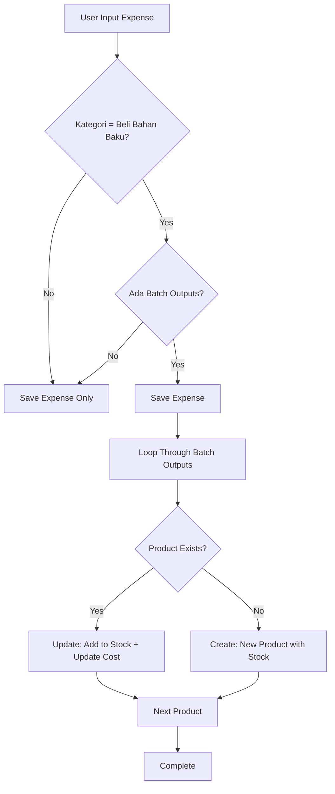

# 🔧 Post-Deployment Fixes & Enhancements

Dokumentasi lengkap untuk 3 perbaikan dan fitur baru yang telah diimplementasikan.

---

## 📋 Daftar Isi

1. [Favicon Fix](#1-favicon-fix-)
2. [Settings Tab Organization](#2-settings-tab-organization-)
3. [Auto-Stock Feature](#3-auto-stock-feature-)

---

## 1. Favicon Fix 🎨

### Problem
Favicon Katalara tidak muncul di browser tab, masih menggunakan default Next.js icon.

### Root Cause
Next.js metadata API (`metadata.icons`) saja tidak cukup. Beberapa browser memerlukan explicit `<link>` tags dalam HTML head.

### Solution Implemented
**File Modified**: `src/app/layout.tsx`

Ditambahkan explicit link tags di dalam `<head>`:

```tsx
<head>
  <link rel="icon" type="image/x-icon" href="/favicon.ico" />
  <link rel="icon" type="image/png" sizes="32x32" href="/favicon-32x32.png" />
  <link rel="icon" type="image/png" sizes="16x16" href="/favicon-16x16.png" />
  <link rel="apple-touch-icon" sizes="180x180" href="/apple-touch-icon.png" />
</head>
```

### Required Files
Pastikan file-file berikut ada di folder `public/`:
- `/favicon.ico`
- `/favicon-32x32.png`
- `/favicon-16x16.png`
- `/apple-touch-icon.png`

### Testing
1. Deploy perubahan ke production
2. Clear browser cache (Ctrl+Shift+Delete)
3. Refresh halaman
4. Cek tab browser - logo Katalara harus muncul

---

## 2. Settings Tab Organization 🎛️

### Problem
Halaman pengaturan terlalu panjang dengan scroll yang tidak terorganisir dengan baik. Sulit menemukan pengaturan spesifik.

### Solution Implemented
**File Modified**: `src/app/dashboard/settings/page.tsx`

Implementasi tab-based navigation dengan 3 kategori:

#### Tab Navigation
```tsx
💰 Keuangan | 🎨 Tampilan | ⚙️ Umum
```

### Tab 1: Keuangan (Financial)
Pengaturan kontrol finansial dan notifikasi:
- **Limit Pengeluaran Harian**: Set batas maksimal pengeluaran per hari
- **Notifikasi Pengeluaran**: Aktifkan/nonaktifkan peringatan
- **Threshold Notifikasi**: Persentase limit untuk memicu peringatan (default: 80%)
- **Target Pemasukan Harian**: Set target revenue harian
- **Tracking ROI**: Aktifkan/nonaktifkan monitoring ROI
- **Periode ROI**: Pilih periode analisis (Harian/Mingguan/Bulanan)

### Tab 2: Tampilan (Display)
Pengaturan visual dan layout:
- **Layout Dashboard**: 
  - Grid (Kotak-kotak) - tampilan card modern
  - List (Daftar Vertikal) - tampilan list kompak
- **Mode Kompak**: Toggle untuk tampilkan lebih banyak info dalam space lebih kecil
- **Animasi**: Aktifkan/nonaktifkan animasi transisi dan efek visual

### Tab 3: Umum (General)
*Currently in development* 🚧
Future features:
- Language settings
- Time zone configuration
- Email notifications
- Export/Import data

### State Management
```typescript
// Tab state
const [activeTab, setActiveTab] = useState<'financial' | 'display' | 'general'>('financial')

// Display settings
const [dashboardLayout, setDashboardLayout] = useState('grid') // 'grid' | 'list'
const [compactMode, setCompactMode] = useState(false)
const [showAnimations, setShowAnimations] = useState(true)
```

### Navigation
Tab switching menggunakan button dengan visual indicator:
- **Active tab**: Blue border bottom + blue text
- **Inactive tab**: Gray text + hover effects

---

## 3. Auto-Stock Feature 📦

### Problem
Saat input expense dengan kategori "Beli Bahan Baku" dan menambahkan batch outputs (hasil produksi), produk-produk tersebut TIDAK otomatis masuk ke inventory/stock.

### Impact
User harus manual:
1. Input expense untuk beli bahan baku
2. Buka halaman Products
3. Manual create/update setiap produk hasil produksi
4. Update stok satu per satu

### Solution Implemented
**File Modified**: `src/app/dashboard/input-expenses/page.tsx`

#### Auto-Stock Workflow



#### Implementation Details

**Function**: `handleAutoStock()`

```typescript
const handleAutoStock = async (
  outputs: Array<{productId: string, productName: string, units: number}>, 
  totalCost: number
) => {
  try {
    // Calculate cost per unit
    const costPerUnit = totalCost / outputs.reduce((sum, o) => sum + o.units, 0)
    
    for (const output of outputs) {
      if (!output.productName || output.units <= 0) continue
      
      // Check if product exists
      const { data: existingProduct } = await supabase
        .from('products')
        .select('*')
        .eq('name', output.productName)
        .single()
      
      if (existingProduct) {
        // UPDATE: Add to existing stock
        await supabase
          .from('products')
          .update({
            stock_quantity: existingProduct.stock_quantity + output.units,
            buy_price: costPerUnit,
            last_restock_date: new Date().toISOString()
          })
          .eq('id', existingProduct.id)
      } else {
        // CREATE: New product
        const { data: userData } = await supabase.auth.getUser()
        if (userData.user) {
          await supabase
            .from('products')
            .insert({
              owner_id: userData.user.id,
              name: output.productName,
              category: 'finished_goods',
              stock_quantity: output.units,
              stock_unit: 'pcs',
              buy_price: costPerUnit,
              sell_price: costPerUnit * 1.3, // Default 30% markup
              min_stock_alert: 10,
              track_inventory: true,
              last_restock_date: new Date().toISOString()
            })
        }
      }
    }
    
    console.log('✅ Auto-stock berhasil')
  } catch (error) {
    console.error('Auto-stock error:', error)
    // Don't throw - expense already saved successfully
  }
}
```

#### Trigger Integration

Modified `handleSubmit()` to call auto-stock after successful expense save:

```typescript
if (response.ok && result.success) {
  // Auto-add batch production outputs to products/stock
  if (category === 'Beli Bahan Baku' && batchOutputs.length > 0) {
    await handleAutoStock(batchOutputs, numAmount)
  }
  
  showToast('success', '✅ Pengeluaran berhasil disimpan!')
  // ... reset form
}
```

#### Product Creation Logic

**For Existing Products**:
- Increment `stock_quantity` with new units
- Update `buy_price` with latest cost per unit
- Update `last_restock_date` to current timestamp

**For New Products**:
- Set `category` = 'finished_goods'
- Set `stock_unit` = 'pcs'
- Calculate `buy_price` = totalCost / totalUnits
- Set `sell_price` = buy_price * 1.3 (30% markup default)
- Set `min_stock_alert` = 10
- Enable `track_inventory` = true
- Set `last_restock_date` = now

#### Cost Calculation

```typescript
// Example:
// Total expense: Rp 1,000,000
// Batch outputs:
//   - Produk A: 50 pcs
//   - Produk B: 100 pcs
//   - Produk C: 50 pcs
// Total units: 200 pcs
// Cost per unit: Rp 5,000/pcs

const costPerUnit = 1000000 / (50 + 100 + 50) = Rp 5,000
```

Each product gets:
- `buy_price` = Rp 5,000
- `sell_price` = Rp 6,500 (with 30% markup)
- `stock_quantity` = their individual units

### Error Handling
- Auto-stock errors are logged to console
- Tidak mengganggu proses save expense
- User tetap melihat success message untuk expense
- Silent fail untuk auto-stock (karena expense sudah tersimpan)

---

## 🚀 Deployment Checklist

### Pre-Deploy
- [x] Test favicon files exist in `/public`
- [x] Test settings tabs switching
- [x] Test display settings state management
- [x] Test auto-stock with batch outputs
- [x] Test auto-stock with existing products
- [x] Test auto-stock with new products

### Deploy Steps
```bash
# 1. Commit changes
git add .
git commit -m "fix: favicon, settings tabs, auto-stock feature"

# 2. Push to production
git push origin main

# 3. Verify deployment
# - Vercel auto-deploy or manual trigger
```

### Post-Deploy Testing

#### 1. Favicon Test
- [ ] Load website in Chrome
- [ ] Load website in Firefox
- [ ] Load website in Safari
- [ ] Check mobile browser
- [ ] Clear cache and reload
- [ ] Verify logo appears in all tabs

#### 2. Settings Tabs Test
- [ ] Open Settings page
- [ ] Click "Keuangan" tab - verify financial settings show
- [ ] Click "Tampilan" tab - verify display settings show
- [ ] Click "Umum" tab - verify "under development" message
- [ ] Toggle switches in Display tab
- [ ] Change layout dropdown
- [ ] Save settings - verify no errors
- [ ] Reload page - verify settings persist

#### 3. Auto-Stock Test
**Test Case 1: New Products**
- [ ] Go to Input Expenses
- [ ] Select category "Beli Bahan Baku"
- [ ] Enter amount: Rp 1,000,000
- [ ] Click "Pembelian Batch"
- [ ] Add output: "Produk Test A" - 100 pcs
- [ ] Add output: "Produk Test B" - 50 pcs
- [ ] Save expense
- [ ] Go to Products page
- [ ] Verify "Produk Test A" exists with 100 stock
- [ ] Verify "Produk Test B" exists with 50 stock
- [ ] Verify buy_price = Rp 6,667 (1,000,000 / 150)
- [ ] Verify sell_price ≈ Rp 8,667 (buy_price * 1.3)

**Test Case 2: Existing Products**
- [ ] Input another expense "Beli Bahan Baku"
- [ ] Amount: Rp 500,000
- [ ] Batch output: "Produk Test A" - 50 pcs
- [ ] Save expense
- [ ] Go to Products page
- [ ] Verify "Produk Test A" stock = 150 (100 + 50)
- [ ] Verify buy_price updated to Rp 10,000 (500,000 / 50)

**Test Case 3: Non-Batch Expense**
- [ ] Input expense with category "Gaji Karyawan"
- [ ] Amount: Rp 5,000,000
- [ ] Save (no batch outputs)
- [ ] Verify no products created/updated
- [ ] Expense saved normally

---

## 📊 Database Schema

### Products Table
Columns used by auto-stock:

```sql
CREATE TABLE products (
  id UUID PRIMARY KEY,
  owner_id UUID REFERENCES auth.users(id),
  name TEXT NOT NULL,
  category TEXT,
  stock_quantity NUMERIC DEFAULT 0,
  stock_unit TEXT DEFAULT 'pcs',
  buy_price NUMERIC DEFAULT 0,
  sell_price NUMERIC DEFAULT 0,
  min_stock_alert NUMERIC DEFAULT 10,
  track_inventory BOOLEAN DEFAULT true,
  last_restock_date TIMESTAMPTZ,
  created_at TIMESTAMPTZ DEFAULT NOW(),
  updated_at TIMESTAMPTZ DEFAULT NOW()
);
```

### Business Configurations Table
Columns for display settings (future):

```sql
ALTER TABLE business_configurations
  ADD COLUMN IF NOT EXISTS dashboard_layout TEXT DEFAULT 'grid',
  ADD COLUMN IF NOT EXISTS compact_mode BOOLEAN DEFAULT false,
  ADD COLUMN IF NOT EXISTS show_animations BOOLEAN DEFAULT true;
```

*Note: Display settings currently use localStorage, database persistence coming in next update.*

---

## 🐛 Known Issues & Future Enhancements

### Current Limitations
1. **Display Settings Not Persisted**: Settings stored in localStorage only, not synced to database
2. **General Tab Empty**: Placeholder for future features
3. **Auto-Stock Silent Fail**: Errors tidak dishow ke user (by design, tapi bisa improved)

### Planned Improvements
1. **Persist Display Settings**: Save to `business_configurations` table
2. **Apply Layout Changes**: Actually implement grid vs list layout
3. **Compact Mode Styling**: Add CSS classes for compact mode
4. **Animation Toggle**: Disable transitions when showAnimations = false
5. **Auto-Stock Notifications**: Show success toast with product count
6. **Batch Edit Products**: Bulk update prices after production
7. **Cost History**: Track buy_price changes over time

---

## 📞 Support

**Issues?**
- Check console for errors: `F12 > Console`
- Check Network tab for API failures
- Verify database permissions in Supabase
- Check RLS policies for `products` table

**Contact**: Development team via dashboard support

---

## 📝 Change Log

### 2024-01-XX - Initial Release
- ✅ Fixed favicon display issue
- ✅ Implemented settings tab organization
- ✅ Created auto-stock feature for batch production
- ✅ Added display settings UI
- ✅ Improved settings page UX

---

**Last Updated**: 2024-01-XX  
**Version**: 1.0.0  
**Status**: ✅ Ready for Production
