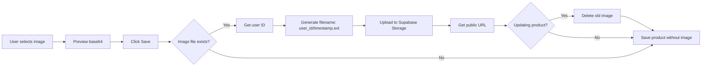

# 📸 Product Image Upload - Setup Guide

## Overview
Fitur upload gambar produk terintegrasi dengan **Supabase Storage** untuk menyimpan gambar dengan aman dan efisien.

## ✅ Completed Changes

### 1. Database Schema
- **File**: `sql/03_add_product_image_column.sql`
- **Column**: `image_url TEXT` ditambahkan ke tabel `products`
- **Status**: ✅ Ready to execute

### 2. Storage Setup
- **File**: `sql/04_setup_product_images_storage.sql`  
- **Bucket**: `product-images` (public bucket)
- **RLS Policies**: 4 policies untuk upload, update, delete, read
- **Status**: ⏳ Needs execution after bucket creation

### 3. Frontend Components
- **ProductModal.tsx**: ✅ Updated
  - Import Supabase client
  - Upload logic ke Storage
  - File path: `{user_id}/{timestamp}.{ext}`
  - Auto-delete old image on update
  - Error handling & loading states
  
- **ProductCardView.tsx**: ✅ Updated
  - Display image jika ada `image_url`
  - Fallback ke icon 📦 jika tidak ada gambar
  - Responsive sizing (10x10 sm:12x12)

## 🚀 Manual Setup Steps

### Step 1: Execute Database Migration
```sql
-- Execute in Supabase SQL Editor
-- File: sql/03_add_product_image_column.sql

ALTER TABLE products 
ADD COLUMN IF NOT EXISTS image_url TEXT;
```

**Verification**:
- Go to Table Editor → `products` table
- Check that `image_url` column exists

---

### Step 2: ~~Create Storage Bucket~~ ✅ SKIP

**Already exists**: Using `lapak-images` bucket (already public)  
**No action needed** - bucket sudah tersedia dengan settings:
- Name: `lapak-images`
- Public: ✅ YES
- File size limit: 5 MB
- Allowed types: image/jpeg, image/jpg, image/png, image/gif, image/webp

**Product images path**: `products/{user_id}/{timestamp}.{ext}`

---

### Step 3: Setup RLS Policies

**Execute in SQL Editor**:
```sql
-- File: sql/04_setup_product_images_storage.sql

-- 1. Allow users to upload their own images
CREATE POLICY "Users can upload their product images"
ON storage.objects FOR INSERT
WITH CHECK (
  bucket_id = 'product-images' 
  AND auth.role() = 'authenticated'
  AND (storage.foldername(name))[1] = auth.uid()::text
);

-- 2. Allow users to update their own images
CREATE POLICY "Users can update their product images"
ON storage.objects FOR UPDATE
USING (
  bucket_id = 'product-images' 
  AND auth.role() = 'authenticated'
  AND (storage.foldername(name))[1] = auth.uid()::text
);

-- 3. Allow users to delete their own images
CREATE POLICY "Users can delete their product images"
ON storage.objects FOR DELETE
USING (
  bucket_id = 'product-images' 
  AND auth.role() = 'authenticated'
  AND (storage.foldername(name))[1] = auth.uid()::text
);

-- 4. Allow public read access
CREATE POLICY "Public can view product images"
ON storage.objects FOR SELECT
USING (bucket_id = 'product-images');
```

**Verification**:
- Go to Storage → `product-images` → **Policies** tab
- Should see 4 policies listed
- Test: Try uploading an image via UI

---

## 🧪 Testing Steps

### Test 1: Add New Product with Image
1. Login to dashboard
2. Go to **Products** → **Tambah Produk**
3. Fill product details
4. Click **"Pilih Gambar"** → Select image file
5. Verify preview shows (24x24 thumbnail)
6. Click **"Simpan"**
7. **Expected**: Product saved with image_url

**Check in Supabase**:
```sql
SELECT id, name, image_url 
FROM products 
WHERE image_url IS NOT NULL;
```

**Check in Storage**:
- Go to Storage → product-images
- Should see file: `{user_id}/{timestamp}.jpg`

---

### Test 2: Update Product Image
1. Edit existing product with image
2. Click **Remove** (X button on preview)
3. Upload new image
4. Save
5. **Expected**: 
   - Old image deleted from Storage
   - New image uploaded
   - `image_url` updated in database

---

### Test 3: Display in Product List
1. Go to **Products** page
2. Find product with image
3. **Expected**: Image shows in card (12x12 rounded)
4. **Fallback**: Products without image show 📦 icon

---

## 📁 File Structure

```
katalara-nextjs/
├── sql/
│   ├── 03_add_product_image_column.sql      ✅ Execute first
│   └── 04_setup_product_images_storage.sql  ✅ Execute after bucket creation
├── src/
│   └── components/
│       └── products/
│           ├── ProductModal.tsx              ✅ Upload logic
│           └── ProductCardView.tsx           ✅ Display logic
└── docs/
    └── PRODUCT_IMAGE_SETUP.md               📄 This file
```

---

## 🔧 How It Works

### Upload Flow


### Storage Path Format
```
lapak-images/
  └── products/
      └── {user_id}/
          ├── 1732345678901.jpg
          ├── 1732345789012.png
          └── 1732345890123.webp
```

**Benefits**:
- Centralized storage (same bucket untuk lapak & products)
- Folder isolation (products/ prefix untuk produk internal)
- User isolation (can't access others' images)
- Unique filenames (timestamp prevents conflicts)
- Easy cleanup (delete all files in user folder)

---

## 🛡️ Security (RLS Policies)

### Policy 1: Upload (INSERT)
```sql
bucket_id = 'lapak-images' 
AND auth.role() = 'authenticated'
AND (storage.foldername(name))[1] = 'products'
AND (storage.foldername(name))[2] = auth.uid()::text
```
✅ Users can only upload to `products/{user_id}/` folder  
❌ Cannot upload to root or other users' folders  
✅ Isolated from lapak marketplace images

### Policy 2: Update
Same as upload, ensures users can only update their own images.

### Policy 3: Delete
Same as upload, ensures users can only delete their own images.

### Policy 4: Public Read (SELECT)
```sql
bucket_id = 'product-images'
```
✅ Anyone can view images (needed for public product display)  
⚠️ Images are public but paths are obscure (user_id + timestamp)

---

## 🐛 Troubleshooting

### Issue 1: Upload fails with "bucket not found"
**Solution**: Create bucket via Dashboard (Step 2)

### Issue 2: Upload fails with "policy violation"
**Solution**: Execute RLS policies (Step 3)

### Issue 3: Image shows broken icon
**Causes**:
- Bucket not public → Make bucket public in settings
- Wrong URL → Check `image_url` format in database
- RLS blocking read → Verify Policy 4 exists

### Issue 4: Can't delete old image
**Debug**:
```javascript
// Check old image path
console.log('Old image URL:', (product as any).image_url)
const oldPath = (product as any).image_url.split('/product-images/').pop()
console.log('Extracted path:', oldPath)
```

**Common causes**:
- URL format mismatch
- RLS delete policy missing
- File already deleted manually

---

## 📊 Database Schema

### products table (updated)
```sql
CREATE TABLE products (
  id UUID PRIMARY KEY,
  owner_id UUID REFERENCES auth.users(id),
  name TEXT NOT NULL,
  sku TEXT,
  category TEXT,
  buy_price NUMERIC(15,2),
  sell_price NUMERIC(15,2),
  stock_quantity NUMERIC(10,2),
  stock_unit TEXT,
  min_stock_alert NUMERIC(10,2),
  track_inventory BOOLEAN DEFAULT true,
  image_url TEXT,  -- ⬅️ NEW COLUMN
  is_active BOOLEAN DEFAULT true,
  created_at TIMESTAMPTZ DEFAULT NOW(),
  updated_at TIMESTAMPTZ DEFAULT NOW()
);
```

---

## 🎯 Next Steps (Optional Enhancements)

### 1. Image Optimization
- Resize images before upload (max 800x800)
- Compress to WebP format
- Generate thumbnails (100x100, 300x300)

### 2. Multiple Images
- Allow 3-5 images per product
- Image gallery carousel
- Set primary image

### 3. Image Validation
- File type check (only jpg, png, webp)
- File size limit (max 5MB)
- Image dimensions check

### 4. Bulk Upload
- Upload multiple products with images via CSV
- Drag & drop multiple images
- Progress bar for batch uploads

### 5. CDN Integration
- Use Cloudflare/CloudFront for faster image delivery
- Image transformations on-the-fly
- Caching strategies

---

## 📝 Code Examples

### Get Product Image URL
```typescript
// In any component
const imageUrl = (product as any).image_url || '/images/product-placeholder.png'


```

### Upload Custom Path
```typescript
// Custom folder structure
const fileName = `${user.id}/category/${product.category}/${Date.now()}.${ext}`
```

### Delete Multiple Images
```typescript
// Cleanup user's all images
const { data, error } = await supabase.storage
  .from('product-images')
  .list(user.id)

if (data) {
  const filePaths = data.map(file => `${user.id}/${file.name}`)
  await supabase.storage.from('product-images').remove(filePaths)
}
```

---

## ✅ Setup Checklist

- [ ] Execute `03_add_product_image_column.sql`
- [ ] Verify `image_url` column exists in products table
- [ ] Create `product-images` bucket (public)
- [ ] Execute `04_setup_product_images_storage.sql`
- [ ] Verify 4 RLS policies exist
- [ ] Test upload new product with image
- [ ] Test update product image
- [ ] Test delete image (X button)
- [ ] Verify image displays in product list
- [ ] Check Storage shows uploaded files

---

## 🎉 Deployment Status

**Deployed**: ✅ November 23, 2025  
**URL**: https://supabase-migration-qh5f0d5rb-katalaras-projects.vercel.app

**Changes Deployed**:
- ProductModal.tsx with Storage upload
- ProductCardView.tsx with image display
- Error handling and loading states
- Auto-delete old images on update

**Pending Manual Steps**:
- Execute SQL migrations in Supabase
- Create Storage bucket
- Setup RLS policies
- Test upload functionality

---

## 📞 Support

**Issues?** Check:
1. Supabase Storage console for errors
2. Browser Network tab for 403/404 errors
3. RLS policies are applied correctly
4. Bucket is public (for read access)

**Still stuck?** Provide:
- Error message (screenshot)
- Browser console logs
- Network request details
- Database query results
